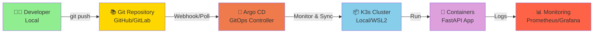
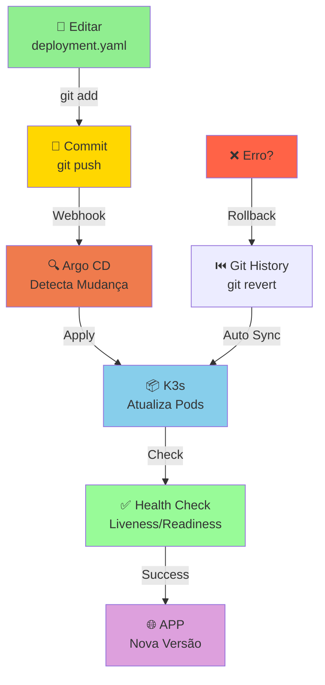

# 🚀 K3s + Argo CD + GitOps - Guia Completo

> **Kubernetes Leve + GitOps no seu Computador Local**


---

## 📋 Visão Geral

Este guia demonstra como:
- ✅ Configurar **K3s** (Kubernetes lightweight) no WSL2
- ✅ Instalar **Argo CD** (GitOps controller)
- ✅ Fazer deploy do **microserviço FastAPI** via GitOps
- ✅ Implementar **reconciliação automática** com Git
- ✅ Usar **declarative model** para infraestrutura

---

## 🎯 Arquitetura GitOps



**Fluxo GitOps:**
```
1. Developer commit código
       ↓
2. Push para repositório Git
       ↓
3. Argo CD detecta mudança (webhook/polling)
       ↓
4. Argo CD lê manifests do Git
       ↓
5. Compara desired state (Git) vs actual state (Cluster)
       ↓
6. Aplica mudanças automáticas no K3s
       ↓
7. Containers rodam com nova versão
```

---

## ⚙️ Pré-requisitos

| 🔧 Componente | ✅ Status | 📋 Comando |
|---|---|---|
| **WSL2 + Ubuntu** | Necessário | Instalar via Microsoft Store |
| **Docker WSL2** | ✅ Já tem | `docker --version` |
| **kubectl** | Vou instalar | `curl -LO kubectl` |
| **K3s** | Vou instalar | `curl -sfL k3s.io` |
| **Argo CD CLI** | Vou instalar | `brew install argocd` |
| **Git** | Necessário | `git --version` |
| **Docker Hub Account** | Necessário | https://hub.docker.com |

---

## 🚀 Passo 1: Preparar WSL2 + Ubuntu

### 1.1 Verificar WSL2 Status

```bash
# No PowerShell (Windows) - verificar WSL
wsl --list --verbose

# Saída esperada:
# NAME            STATE           VERSION
# Ubuntu          Running         2
```

### 1.2 Atualizar Sistema Ubuntu

```bash
# Entrar no WSL2
wsl

# Atualizar packages
sudo apt update && sudo apt upgrade -y

# Instalar dependências
sudo apt install -y curl wget git build-essential
```

### 1.3 Instalar Docker CLI no WSL2 (se não tiver)

```bash
# Instalar Docker CLI
curl -fsSL https://download.docker.com/linux/ubuntu/gpg | sudo apt-key add -
sudo add-apt-repository "deb [arch=amd64] https://download.docker.com/linux/ubuntu $(lsb_release -cs) stable"
sudo apt update
sudo apt install -y docker-ce-cli

# Verificar
docker --version
# Output: Docker version X.X.X
```

---

## 🎯 Passo 2: Instalar K3s no WSL2

K3s é uma distribuição Kubernetes minimalista perfeita para desenvolvimento local.

### 2.1 Instalar K3s

```bash
# Download e instalar K3s
curl -sfL https://get.k3s.io | sh -

# Dar permissão ao arquivo de config
sudo chmod 644 /etc/rancher/k3s/k3s.yaml

# Exportar KUBECONFIG
export KUBECONFIG=/etc/rancher/k3s/k3s.yaml

# Adicionar ao ~/.bashrc para persistência
echo 'export KUBECONFIG=/etc/rancher/k3s/k3s.yaml' >> ~/.bashrc
source ~/.bashrc
```

### 2.2 Verificar Cluster K3s

```bash
# Verificar se K3s está rodando
sudo systemctl status k3s

# Listar nós
kubectl get nodes

# Saída esperada:
# NAME     STATUS   ROLES                  AGE     VERSION
# ubuntu   Ready    control-plane,master   XXs     v1.XX.X+k3s1

# Listar pods do sistema
kubectl get pods -n kube-system

# Saída esperada:
# NAME                                      READY   STATUS    RESTARTS   AGE
# coredns-6799bdad5-xxxxx                   1/1     Running   0          30s
# local-path-provisioner-6c86858495-xxxxx   1/1     Running   0          30s
# metrics-server-54fd3fccb9-xxxxx           1/1     Running   0          30s
```

### 2.3 Kubectl Autocompletion (Opcional)

```bash
# Instalar bash-completion
sudo apt install -y bash-completion

# Adicionar kubectl completion
echo 'source <(kubectl completion bash)' >> ~/.bashrc
source ~/.bashrc
```

---

## 🐳 Passo 3: Preparar Docker Hub e Imagem

### 3.1 Login no Docker Hub

```bash
# Login interativo
docker login

# Preencha:
# Username: seu-usuario-dockerhub
# Password: seu-token-ou-senha
```

### 3.2 Build e Push da Imagem FastAPI

```bash
# Entrar na pasta do projeto
cd ~/DevOps-AWS

# Build da imagem
docker build -t seu-usuario-dockerhub/fastapi-app:latest .

# Push para Docker Hub
docker push seu-usuario-dockerhub/fastapi-app:latest

# Verificar se subiu
# Acesse: https://hub.docker.com/r/seu-usuario-dockerhub/fastapi-app
```

---

## 🔄 Passo 4: Instalar Argo CD

Argo CD é um GitOps controller declarativo para Kubernetes.

### 4.1 Criar Namespace Argo CD

```bash
# Criar namespace
kubectl create namespace argocd

# Verificar
kubectl get namespaces | grep argocd
```

### 4.2 Instalar Argo CD

```bash
# Download do manifests oficial
kubectl apply -n argocd -f https://raw.githubusercontent.com/argoproj/argo-cd/stable/manifests/install.yaml

# Aguardar pods ficarem ready (~2 minutos)
kubectl wait --for=condition=ready pod -l app.kubernetes.io/name=argocd-server -n argocd --timeout=300s

# Verificar instalação
kubectl get pods -n argocd

# Saída esperada:
# NAME                                READY   STATUS    RESTARTS   AGE
# argocd-application-controller-xxx   1/1     Running   0          2m
# argocd-dex-server-xxx               1/1     Running   0          2m
# argocd-redis-xxx                    1/1     Running   0          2m
# argocd-server-xxx                   1/1     Running   0          2m
```

### 4.3 Instalar Argo CD CLI

```bash
# Opção 1: Homebrew (se tiver)
brew install argocd

# Opção 2: Download direto
curl -sSL -o argocd-linux-amd64 https://github.com/argoproj/argo-cd/releases/latest/download/argocd-linux-amd64
sudo install -m 555 argocd-linux-amd64 /usr/local/bin/argocd
rm argocd-linux-amd64

# Verificar
argocd version
```

---

## 📊 Passo 5: Acessar Argo CD Web UI

### 5.1 Port-Forward para Acessar UI

```bash
# Em um terminal dedicado, fazer port-forward
kubectl port-forward svc/argocd-server -n argocd 8080:443

# Saída:
# Forwarding from 127.0.0.1:8080 -> 8080
# Forwarding from [::1]:8080 -> 8080
```

### 5.2 Obter Senha Inicial

```bash
# Pegar password padrão (username: admin)
kubectl -n argocd get secret argocd-initial-admin-secret -o jsonpath="{.data.password}" | base64 -d; echo

# Saída: sua-senha-aleatoria
```

### 5.3 Acessar UI

```
URL: https://localhost:8080
Username: admin
Password: <senha do comando anterior>
```

> ⚠️ **Aviso SSL**: Navegador vai reclamar de certificado auto-assinado, clique "Avançado" e prossiga

---

## 📚 Passo 6: Criar Repositório GitOps

### 6.1 Estrutura de Diretórios

Crie a seguinte estrutura no seu repositório Git:

```
devops-k3s-gitops/
├── 📄 README.md
├── 🔐 .gitignore
└── kubernetes/
    ├── 📁 apps/
    │   └── fastapi-app/
    │       ├── deployment.yaml       (Pod Definition)
    │       ├── service.yaml          (Network)
    │       ├── ingress.yaml          (HTTP Access)
    │       ├── configmap.yaml        (Configuration)
    │       └── secrets.yaml          (Sensitive Data)
    ├── 📁 argocd/
    │   ├── application.yaml          (Argo CD Application)
    │   └── appproject.yaml           (RBAC)
    └── 📁 infrastructure/
        ├── namespaces.yaml
        ├── rbac.yaml
        └── storage.yaml
```

### 6.2 Criar Deployment FastAPI

**`kubernetes/apps/fastapi-app/deployment.yaml`:**

```yaml
apiVersion: apps/v1
kind: Deployment
metadata:
  name: fastapi-app
  namespace: fastapi
  labels:
    app: fastapi-app
    version: v1
spec:
  replicas: 2  # ✅ Alta disponibilidade
  strategy:
    type: RollingUpdate
    rollingUpdate:
      maxSurge: 1
      maxUnavailable: 0
  selector:
    matchLabels:
      app: fastapi-app
  template:
    metadata:
      labels:
        app: fastapi-app
      annotations:
        prometheus.io/scrape: "true"
        prometheus.io/port: "8000"
    spec:
      # ✅ Política de reinicialização
      restartPolicy: Always
      
      # ✅ Health checks
      containers:
      - name: fastapi
        image: seu-usuario-dockerhub/fastapi-app:latest
        imagePullPolicy: Always
        
        # ✅ Portas
        ports:
        - name: http
          containerPort: 8000
          protocol: TCP
        
        # ✅ Resources
        resources:
          requests:
            memory: "128Mi"
            cpu: "100m"
          limits:
            memory: "512Mi"
            cpu: "500m"
        
        # ✅ Liveness Probe (container vivo?)
        livenessProbe:
          httpGet:
            path: /
            port: 8000
          initialDelaySeconds: 10
          periodSeconds: 10
          timeoutSeconds: 5
          failureThreshold: 3
        
        # ✅ Readiness Probe (container pronto?)
        readinessProbe:
          httpGet:
            path: /
            port: 8000
          initialDelaySeconds: 5
          periodSeconds: 5
          timeoutSeconds: 3
          failureThreshold: 3
        
        # ✅ Variáveis de ambiente
        env:
        - name: ENVIRONMENT
          value: "development"
        - name: LOG_LEVEL
          value: "INFO"
      
      # ✅ Node affinity (spread entre nós)
      affinity:
        podAntiAffinity:
          preferredDuringSchedulingIgnoredDuringExecution:
          - weight: 100
            podAffinityTerm:
              labelSelector:
                matchExpressions:
                - key: app
                  operator: In
                  values:
                  - fastapi-app
              topologyKey: kubernetes.io/hostname
```

### 6.3 Criar Service

**`kubernetes/apps/fastapi-app/service.yaml`:**

```yaml
apiVersion: v1
kind: Service
metadata:
  name: fastapi-app
  namespace: fastapi
  labels:
    app: fastapi-app
spec:
  type: ClusterIP  # ✅ Interno (não expor direto)
  selector:
    app: fastapi-app
  ports:
  - name: http
    port: 80
    targetPort: 8000
    protocol: TCP
  sessionAffinity: None
```

### 6.4 Criar Ingress (HTTP Access)

**`kubernetes/apps/fastapi-app/ingress.yaml`:**

```yaml
apiVersion: networking.k8s.io/v1
kind: Ingress
metadata:
  name: fastapi-app
  namespace: fastapi
  annotations:
    kubernetes.io/ingress.class: "traefik"  # K3s usa Traefik
spec:
  rules:
  - host: fastapi-app.local
    http:
      paths:
      - path: /
        pathType: Prefix
        backend:
          service:
            name: fastapi-app
            port:
              number: 80
```

### 6.5 Criar Namespace

**`kubernetes/infrastructure/namespaces.yaml`:**

```yaml
apiVersion: v1
kind: Namespace
metadata:
  name: fastapi
  labels:
    name: fastapi
    environment: development
```

---

## 🔐 Passo 7: Criar Argo CD Application

### 7.1 Conectar Git Repository ao Argo CD

```bash
# Via CLI (mais prático)
argocd repo add https://github.com/seu-usuario/devops-k3s-gitops.git \
  --username seu-usuario-github \
  --password seu-token-github

# Ou via UI:
# Argo CD → Settings → Repositories → Connect Repo
```

### 7.2 Criar Application YAML

**`kubernetes/argocd/application.yaml`:**

```yaml
apiVersion: argoproj.io/v1alpha1
kind: Application
metadata:
  name: fastapi-app
  namespace: argocd
spec:
  # ✅ Projeto Argo CD
  project: default
  
  # ✅ Fonte do Git
  source:
    repoURL: https://github.com/seu-usuario/devops-k3s-gitops.git
    targetRevision: main
    path: kubernetes/apps/fastapi-app
  
  # ✅ Destino (K3s)
  destination:
    server: https://kubernetes.default.svc
    namespace: fastapi
  
  # ✅ Sincronização automática
  syncPolicy:
    automated:
      prune: true      # Remove recursos deletados do Git
      selfHeal: true   # Auto-reconcilia divergências
      allow:
        empty: false
    syncOptions:
    - CreateNamespace=true
    retry:
      limit: 5
      backoff:
        duration: 5s
        factor: 2
        maxDuration: 3m
  
  # ✅ Notificações de sincronização
  ignoreDifferences:
  - group: apps
    kind: Deployment
    jsonPointers:
    - /spec/replicas  # Ignorar mudanças de replicas por hora
```

### 7.3 Deploy da Application

```bash
# Criar namespace argocd (se não existir)
kubectl create namespace fastapi 2>/dev/null || true

# Aplicar Infrastructure primeiro
kubectl apply -f kubernetes/infrastructure/namespaces.yaml

# Aplicar Application
kubectl apply -f kubernetes/argocd/application.yaml

# Verificar status
kubectl get applications -n argocd

# Saída esperada:
# NAME           SYNC STATUS   HEALTH STATUS   
# fastapi-app    Synced        Healthy
```

---

## ✨ Passo 8: GitOps em Ação

### 8.1 Fazer Mudança e Commitar

```bash
# No repositório local (Git)
cd devops-k3s-gitops

# Editar deployment (aumentar replicas)
vi kubernetes/apps/fastapi-app/deployment.yaml
# Mudar replicas de 2 para 3

# Commitar
git add kubernetes/apps/fastapi-app/deployment.yaml
git commit -m "chore: scale fastapi-app to 3 replicas"
git push origin main
```

### 8.2 Argo CD Detecta Mudança

```bash
# Forçar reconciliação imediata (ou aguardar ~3 minutos)
argocd app sync fastapi-app

# Verificar status
argocd app get fastapi-app

# Monitorar pods em tempo real
kubectl get pods -n fastapi -w

# Saída esperada:
# NAME                            READY   STATUS    RESTARTS   AGE
# fastapi-app-5f7d8c9f-xxxxx     1/1     Running   0          30s
# fastapi-app-5f7d8c9f-yyyyy     1/1     Running   0          30s
# fastapi-app-5f7d8c9f-zzzzz     1/1     Running   0          10s (novo!)
```

### 8.3 Acessar Aplicação

```bash
# Port-forward para testar
kubectl port-forward -n fastapi svc/fastapi-app 8000:80

# Ou editar /etc/hosts (Windows + WSL)
# 127.0.0.1 fastapi-app.local

# Acessar
curl http://localhost:8000/
# ou
curl http://fastapi-app.local/

# Resposta esperada:
# {"status": "healthy", "message": "API rodando com sucesso!"}
```

---

## 📊 Passo 9: Monitoramento com Prometheus + Grafana (Opcional)

### 9.1 Instalar Prometheus Stack

```bash
# Adicionar repositório Helm
helm repo add prometheus-community https://prometheus-community.github.io/helm-charts
helm repo update

# Instalar
helm install prometheus prometheus-community/kube-prometheus-stack \
  -n monitoring \
  --create-namespace \
  --values - <<EOF
prometheus:
  prometheusSpec:
    resources:
      requests:
        memory: "256Mi"
        cpu: "100m"
grafana:
  adminPassword: "admin123"
EOF
```

### 9.2 Acessar Grafana

```bash
# Port-forward
kubectl port-forward -n monitoring svc/prometheus-grafana 3000:80

# Acessar
# URL: http://localhost:3000
# Username: admin
# Password: admin123
```

---

## 🐛 Troubleshooting Comum

### ❌ "K3s não inicia no WSL2"

```bash
# Verificar status
sudo systemctl status k3s

# Reiniciar
sudo systemctl restart k3s

# Ver logs
sudo journalctl -u k3s -f
```

### ❌ "Argo CD não consegue sync"

```bash
# Verificar conexão Git
argocd repo list

# Verificar Application status detalhado
argocd app get fastapi-app --refresh

# Ver logs do Argo CD
kubectl logs -n argocd -l app.kubernetes.io/name=argocd-application-controller -f
```

### ❌ "Pod fica em CrashLoopBackOff"

```bash
# Ver logs do container
kubectl logs -n fastapi <pod-name> -f

# Ver descrição do pod
kubectl describe pod -n fastapi <pod-name>

# Entrar no container
kubectl exec -it -n fastapi <pod-name> -- bash
```

### ❌ "Docker Hub rate limiting"

```bash
# Criar secret para credenciais
kubectl create secret docker-registry dockerhub \
  -n fastapi \
  --docker-server=docker.io \
  --docker-username=seu-usuario \
  --docker-password=seu-token

# Adicionar ao deployment.yaml:
# imagePullSecrets:
# - name: dockerhub
```

---

## 🎯 Fluxo de Trabalho Diário com GitOps



### Checklist Diário:

```
☑ Monitorar status Argo CD
  - Sync Status: Synced
  - Health: Healthy

☑ Verificar logs com:
  - kubectl logs -n fastapi -l app=fastapi-app

☑ Testar aplicação:
  - curl http://fastapi-app.local/

☑ Revisar dashboards:
  - Argo CD UI (https://localhost:8080)
  - Grafana (http://localhost:3000)

☑ Fazer backup do estado:
  - kubectl get all -n fastapi -o yaml > backup.yaml
```

---

## 🚀 Próximos Passos

| 🎯 Etapa | 📝 Descrição | ⏱️ Tempo |
|---|---|---|
| **1. Setup K3s** | Instalar e validar cluster | 15 min |
| **2. Argo CD** | Instalar e acessar UI | 10 min |
| **3. Repositório Git** | Criar estrutura de manifests | 15 min |
| **4. Application** | Deploy via GitOps | 10 min |
| **5. Testing** | Validar e testar mudanças | 20 min |
| **6. Monitoring** | Prometheus + Grafana | 15 min |
| **7. CI/CD** | Integrar com GitHub Actions | 30 min |

**Total Estimado**: ~2 horas

---

## 📚 Recursos Úteis

```
DOCUMENTAÇÃO
├─ K3s: https://docs.k3s.io
├─ Kubernetes: https://kubernetes.io/docs
├─ Argo CD: https://argo-cd.readthedocs.io
├─ Helm: https://helm.sh/docs
└─ GitOps: https://opengitops.dev

FERRAMENTAS
├─ kubectl: CLI Kubernetes
├─ argocd: CLI Argo CD
├─ helm: Package manager K8s
├─ k9s: Dashboard TUI para K8s
└─ kubectx: Switch contexts rápido

COMUNIDADES
├─ Kubernetes Slack
├─ CNCF Community
├─ Stack Overflow
└─ Reddit /r/kubernetes
```

---

## 🎓 Conceitos Aprendidos

| 📚 Conceito | 🎯 O que você aprendeu |
|---|---|
| **K3s** | Kubernetes lightweight para desenvolvimento |
| **GitOps** | Infraestrutura declarativa versionada |
| **Argo CD** | Reconciliação automática Git ↔ Cluster |
| **Deployment** | Rollout com zero-downtime |
| **Health Checks** | Liveness e Readiness probes |
| **Namespaces** | Isolamento lógico de recursos |
| **Services** | Network policies e load balancing |
| **Ingress** | HTTP routing e SSL/TLS |

---

## 💡 Tips & Tricks

```bash
# Aliases úteis (adicionar ao ~/.bashrc)
alias k=kubectl
alias kgp='kubectl get pods'
alias kgs='kubectl get svc'
alias kgd='kubectl get deployment'
alias kdel='kubectl delete pod'
alias klogs='kubectl logs'
alias kctx='kubectl config current-context'

# Autocompletion
source <(kubectl completion bash)
alias k=kubectl
complete -o default -F __start_kubectl k

# Watch em tempo real
kubectl get pods -n fastapi -w

# Executar comando no pod
kubectl exec -it <pod-name> -n fastapi -- bash

# Copiar arquivo para pod
kubectl cp arquivo.txt <pod-name>:/app/ -n fastapi
```

---

**Última atualização**: Julho 2024  
**Status**: ✅ Testado em WSL2 + Ubuntu  
**Versão**: 1.0.0
