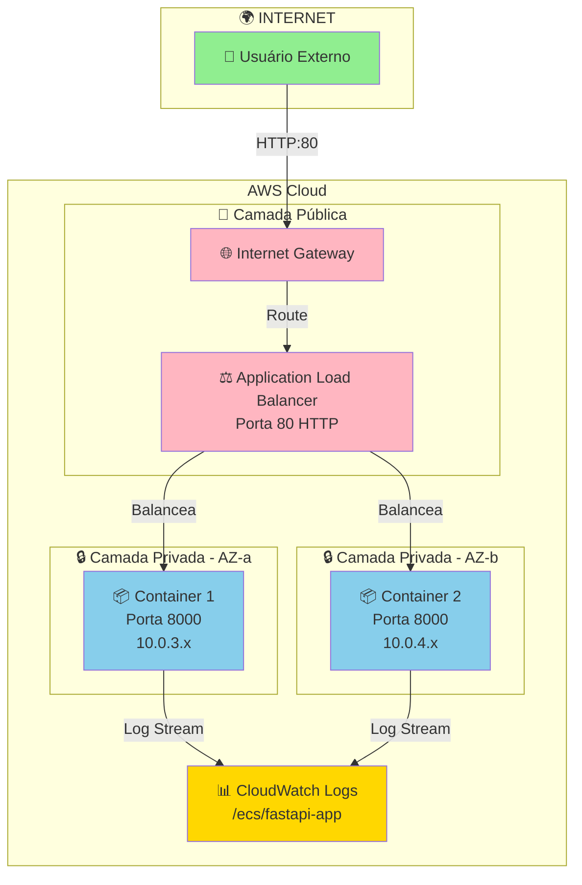
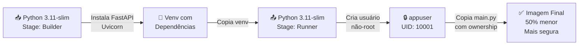
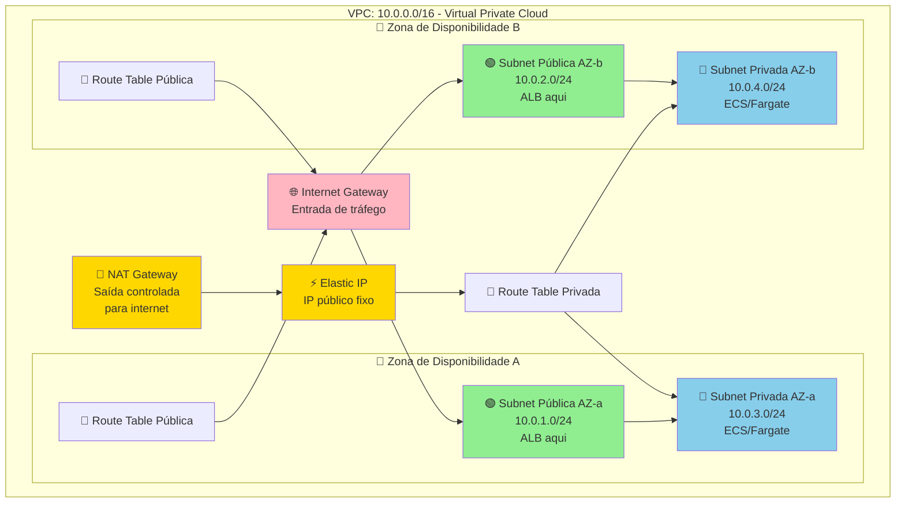
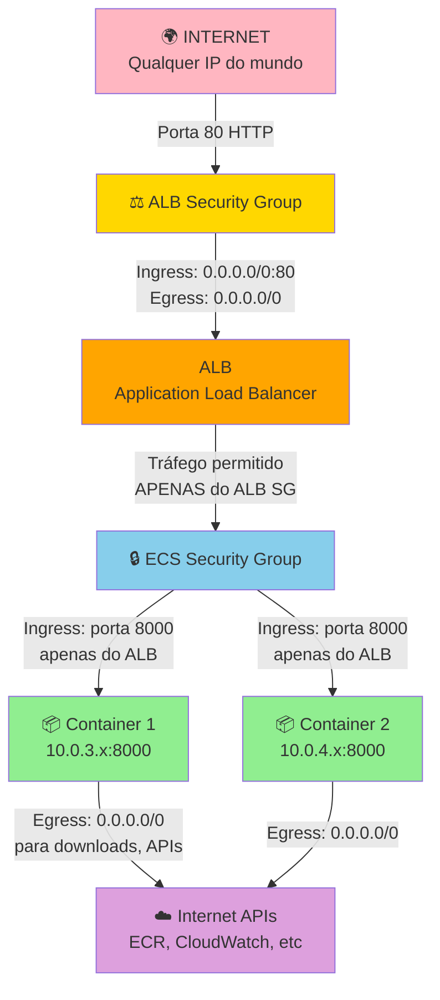
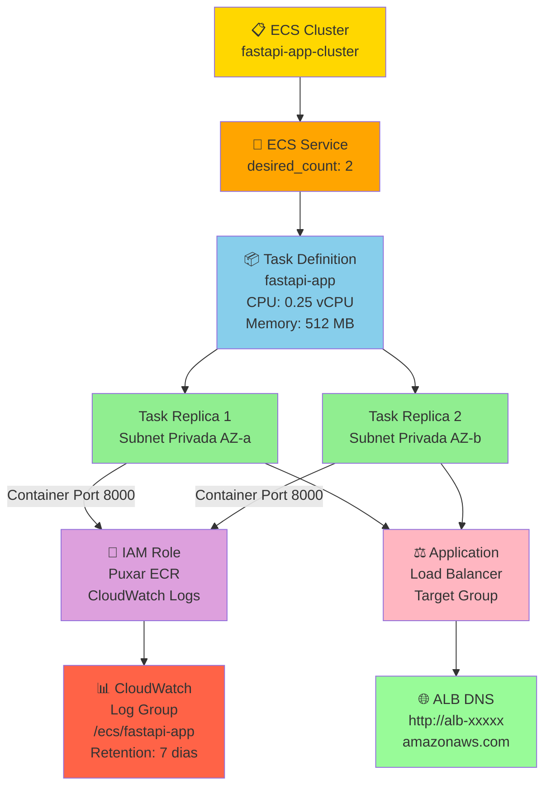
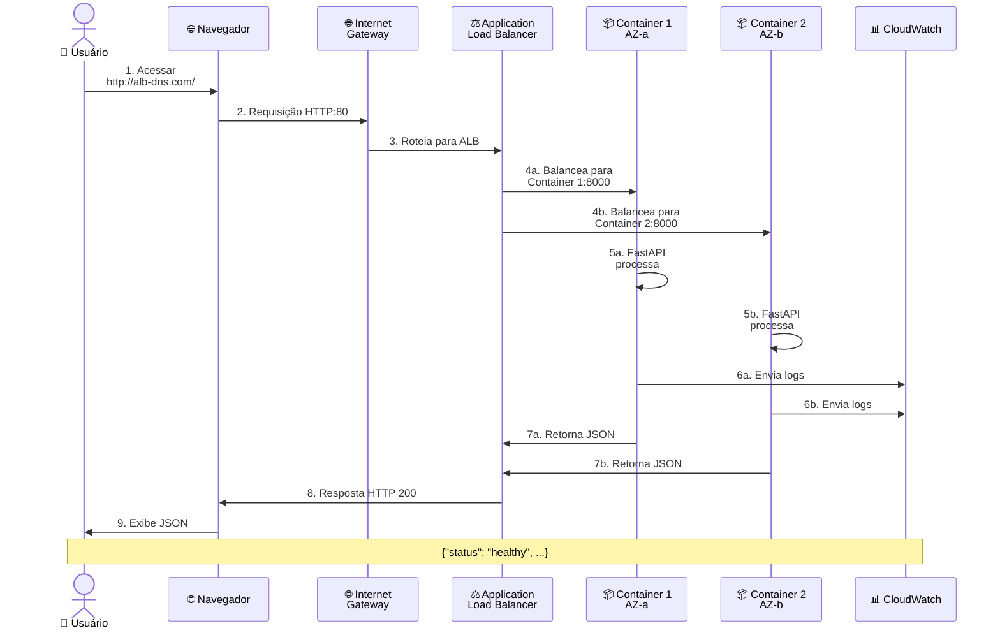
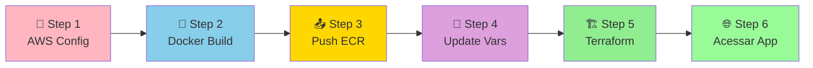
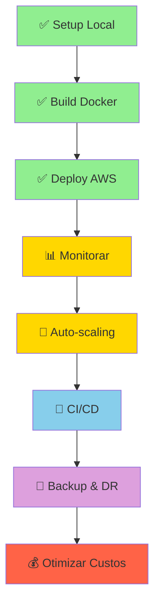

# 🚀 DevOps-AWS

> **Infraestrutura em Nuvem Completa com Terraform, Docker e AWS**


---

## 📋 Visão Geral

Este repositório demonstra um **fluxo profissional de deploy** na AWS usando Infrastructure as Code (IaC) com Terraform e containerização Docker.

| 🏗️ Componente | 📦 Tecnologia | ✨ Função |
|---|---|---|
| **Aplicação** | Python + FastAPI | API REST escalável |
| **Containerização** | Docker Multi-stage | Imagem leve e segura |
| **Orquestração** | ECS Fargate | Serverless container management |
| **Balanceamento** | Application Load Balancer | Distribuição de tráfego |
| **Rede** | VPC Multi-AZ | Isolamento e alta disponibilidade |
| **Segurança** | Security Groups | Firewall configurável |
| **IaC** | Terraform | Automação de infraestrutura |

---

## 🎯 Arquitetura em Camadas



---

## 📂 Estrutura do Repositório

```
DevOps-AWS/
├── 📄 main.py                      ← Aplicação FastAPI
├── 🐳 Dockerfile                   ← Build Multi-stage
├── 📖 README.md                    ← Este arquivo
└── 🏗️ Terraform/
    ├── 🌐 network.tf               ← VPC, Subnets, NAT Gateway
    ├── 🔒 security.tf              ← Security Groups
    ├── ⚙️ ecs.tf                    ← ECS, Fargate, Task Definition
    ├── ⚖️ alb.tf                    ← Application Load Balancer
    ├── 📋 providers.tf             ← Configuração AWS
    ├── 📝 variables.tf             ← Variáveis customizáveis
    ├── 📤 outputs.tf               ← Saídas (DNS ALB, etc)
    └── 💾 terraform.tfstate        ← Estado (gerado)
```

---

## 🎓 Guia Passo a Passo - Como o Projeto Funciona

### 1️⃣ **A Aplicação Python** (`main.py`)

```python
from fastapi import FastAPI

app = FastAPI()

@app.get("/")
def read_root():
    return {"status": "healthy", "message": "API rodando com sucesso!"}
```

**O que faz:**
- 📡 Uma **API REST simples** construída com FastAPI
- 📨 Endpoint GET `/` retorna JSON com status da aplicação
- 🔌 Roda na porta **8000** dentro do container
- 📈 Escalável para adicionar mais endpoints

**Resposta Esperada:**
```json
{
  "status": "healthy",
  "message": "API rodando com sucesso!"
}
```

---

### 2️⃣ **Containerização** (`Dockerfile`) - Multi-stage Build 🐳



**Estágio 1 - Builder (Compilação)** 🔨
- Instala Python 3.11, ferramentas de build
- Cria ambiente virtual (`/opt/venv`)
- Instala FastAPI e Uvicorn
- **Descartado** ao final (não fica na imagem final)

**Estágio 2 - Runner (Execução)** 🎯
- Copia **apenas** o venv do Builder (reduz tamanho 50%)
- Cria usuário não-root `appuser` (segurança)
- Copia `main.py` com ownership correto
- Executa com usuário sem privilégios

**Benefícios:**
| Aspecto | Ganho |
|--------|-------|
| 📦 **Tamanho** | 50% menor (sem ferramentas de build) |
| 🔒 **Segurança** | Sem privilégios root |
| ⚡ **Performance** | Build cache otimizado |
| 🔄 **CI/CD** | Deploy mais rápido |

---

### 3️⃣ **Infraestrutura AWS (Terraform)** ☁️

#### 📋 Configuração Inicial (`providers.tf`)
- Define que usamos o **provedor AWS** versão 5.x
- Região padrão: `us-east-1` (configurável em `variables.tf`)

#### 🌐 Arquitetura de Rede (`network.tf`)



**Componentes:**

| 🔧 Componente | 🎯 Função | 📊 Detalhes |
|---|---|---|
| **VPC** | Rede isolada na AWS | 10.0.0.0/16 (65k IPs) |
| **Internet Gateway** | Conecta VPC à internet | Permite requisições entrada |
| **Subnets Públicas** | Acessíveis da internet | ALB (Load Balancer) fica aqui |
| **Subnets Privadas** | NÃO acessíveis de fora | Containers ECS/Fargate isolados |
| **NAT Gateway** | Saída controlada | Permite downloads sem expor serviços |
| **Route Tables** | Definem caminhos | Pública→IGW, Privada→NAT |
| **Elastic IP** | IP público fixo | Associado ao NAT Gateway |

**✅ Benefícios:**
- 🔒 Isolamento: Containers não expostos à internet
- 📍 Multi-AZ: Alta disponibilidade em 2 data centers
- ⚡ Escalabilidade: Fácil adicionar mais subnets
- 🛡️ Segurança: Camadas de rede bem definidas

#### 🔒 Firewall (Security Groups) (`security.tf`)


**Regras de Segurança:**

| 🚪 Direção | 🔓 ALB Security Group | 🔒 ECS Security Group |
|---|---|---|
| **Ingress (Entrada)** | `0.0.0.0/0:80` (mundo inteiro) | Porta 8000 (apenas ALB SG) |
| **Egress (Saída)** | `0.0.0.0/0` (qualquer destino) | `0.0.0.0/0` (APIs, downloads) |

**🛡️ Proteção Garantida:**
- ✅ Internet acessa **APENAS porta 80** do ALB
- ✅ Containers recebem tráfego **APENAS** do ALB
- ✅ Containers podem fazer requisições para fora (downloads, APIs externas)
- ✅ Isolamento em camadas (Defense in Depth)

#### 🎛️ Container Orchestration (`ecs.tf`)


**Componentes:**

| 🔧 Componente | 📝 Descrição | ⚙️ Configuração |
|---|---|---|
| **ECS Cluster** | Orquestrador de containers | `fastapi-app-cluster` |
| **ECS Service** | Mantém replicas rodando | `desired_count: 2` |
| **Task Definition** | Blueprint do container | CPU 0.25, RAM 512MB, Porta 8000 |
| **IAM Role** | Permissões | Puxar ECR, CloudWatch Logs |
| **CloudWatch Logs** | Monitora saída | Retém 7 dias `/ecs/fastapi-app` |
| **ALB Target Group** | Destino do load balancer | Conecta replicas ao ALB |

**🚀 Características:**
- ⚡ **Fargate** (Serverless): Sem gerenciar servidores
- 🔄 **Auto-recovery**: Se task falhar, ECS levanta outra
- 📊 **Multi-AZ**: Réplicas em zonas diferentes (HA)
- 🎚️ **Load Balancing**: Tráfego distribuído entre replicas
- 📈 **Escalável**: Ajustar `desired_count` para scale up/down

---

### 4️⃣ **Fluxo Completo de Requisição** 🔄


**Passo a Passo:**

| 📊 Etapa | 🎯 O que acontece | ⏱️ Tempo |
|---|---|---|
| 1️⃣ | Usuário acessa URL do ALB | ~0ms |
| 2️⃣ | Requisição chega via Internet Gateway | ~10ms |
| 3️⃣ | ALB recebe na porta 80 | ~20ms |
| 4️⃣ | ALB balanceia entre 2 containers | ~5ms |
| 5️⃣ | Container processa (main.py) | ~50ms |
| 6️⃣ | Logs enviados ao CloudWatch | ~30ms |
| 7️⃣ | Response JSON retorna | ~10ms |
| 8️⃣ | Browser recebe resposta | ~20ms |
| 9️⃣ | Usuário vê resultado | **~145ms total** |

---

### 5️⃣ **Resumo da Arquitetura Completa** 📋

| 🏗️ Camada | 💻 Tecnologia | 🎯 Função |
|---|---|---|
| **Aplicação** | 🐍 Python + FastAPI | API REST que responde requisições HTTP |
| **Container** | 🐳 Docker Multi-stage | Empacota app de forma isolada e leve |
| **Orquestração** | ⚙️ ECS Fargate | Gerencia 2 replicas serverless |
| **Balanceamento** | ⚖️ ALB (Application LB) | Distribui tráfego entre replicas |
| **Rede** | 🌐 VPC + Subnets Multi-AZ | Isolamento público/privado + HA |
| **Firewall** | 🔒 Security Groups | Controla fluxo de tráfego |
| **IaC** | 📋 Terraform | Automatiza toda infraestrutura |
| **Monitoramento** | 📊 CloudWatch | Logs centralizados e métricas |

---

## ✅ **Benefícios da Arquitetura Completa**

```
🚀 ESCALÁVEL          🔒 SEGURA             📊 RESILIENTE        💰 CUSTO-EFICIENTE
├─ +Replicas         ├─ Containers         ├─ Auto-recovery      ├─ Serverless
├─ Auto-scaling      │  isolados           ├─ Multi-AZ           ├─ Pay-per-use
└─ Load balancing    ├─ Subnets privadas   └─ Health checks      └─ Sem overhead
                     └─ IAM granular
                     
🔍 MONITORÁVEL       🤖 AUTOMATIZADO       ⚡ PERFORMÁTICO      📈 OBSERVÁVEL
├─ CloudWatch logs   ├─ Terraform IaC      ├─ Latência ~150ms    ├─ Métricas
├─ Métricas          ├─ Git-driven         ├─ Multi-AZ HA        ├─ Alertas
└─ Alertas           └─ Reproduzível       └─ Fargate optimizado └─ Dashboards
```

---

Pré-requisitos
- `terraform` (recomendado >= 1.0)
- `aws` CLI (credenciais configuradas: `aws configure`)
- `docker` (para construir a imagem localmente)
- Python 3.8+ (se for executar `main.py` localmente)

---

## 🚀 **Setup e Deploy Completo - Guia Prático**



### 📝 **Passo 1: Configurar Credenciais AWS**
```bash
aws configure
# Preencha:
# - AWS Access Key ID
# - AWS Secret Access Key
# - Default region: us-east-1 (ou sua região)
# - Default output format: json
```

### 🐳 **Passo 2: Construir Imagem Docker Localmente**

```bash
# Build com Multi-stage (builder + runner)
docker build -t devops-aws-app:latest .

# Testar localmente
docker run -p 8000:8000 devops-aws-app:latest

# ✅ Acessar: http://localhost:8000/
# Resposta esperada:
# {"status": "healthy", "message": "API rodando com sucesso!"}
```

### 📤 **Passo 3: Push da Imagem para Amazon ECR**

```bash
# 1️⃣ Criar repositório no ECR (primeira vez)
aws ecr create-repository --repository-name fastapi-app --region us-east-1

# 2️⃣ Fazer login no ECR
aws ecr get-login-password --region us-east-1 | docker login --username AWS --password-stdin <SEU_ACCOUNT_ID>.dkr.ecr.us-east-1.amazonaws.com

# 3️⃣ Tag a imagem com URI do ECR
docker tag devops-aws-app:latest <SEU_ACCOUNT_ID>.dkr.ecr.us-east-1.amazonaws.com/fastapi-app:latest

# 4️⃣ Push para ECR
docker push <SEU_ACCOUNT_ID>.dkr.ecr.us-east-1.amazonaws.com/fastapi-app:latest
```

> ⚠️ **Nota**: Substitua `<SEU_ACCOUNT_ID>` pelo seu AWS Account ID

### 📝 **Passo 4: Atualizar Variáveis Terraform**

Edite `Terraform/variables.tf`:

```hcl
variable "container_image" {
  # ANTES (placeholder):
  default = "nginx:latest"
  
  # DEPOIS (sua imagem ECR):
  default = "<SEU_ACCOUNT_ID>.dkr.ecr.us-east-1.amazonaws.com/fastapi-app:latest"
}
```

### 🏗️ **Passo 5: Deploy com Terraform**

```bash
cd Terraform

# ✅ Inicializa o Terraform (primeira vez)
terraform init

# ✅ Visualiza o plano de execução
terraform plan -out=tfplan

# ✅ Aplica o plano (cria infraestrutura na AWS)
terraform apply tfplan

# Alternativa: aplicar direto sem salvar plano
# terraform apply -auto-approve
```

**⏱️ Tempo esperado**: 3-5 minutos para toda infraestrutura ficar pronta

### 🌐 **Passo 6: Acessar a Aplicação**

```bash
# Obter DNS do ALB
cd Terraform
terraform output

# Copie a saída e acesse no navegador:
# http://<ALB_DNS>/
```

✅ Aguarde alguns segundos para as tarefas ECS ficarem saudáveis (Health Check)

---

## 📊 **Visualizando o Deploy**

```
0 min  ├─ terraform init
       └─ Download plugins AWS
       
1 min  ├─ terraform plan -out=tfplan
       └─ Valida configuração
       
2 min  ├─ terraform apply tfplan
       ├─ Cria VPC
       ├─ Cria Subnets
       ├─ Cria ALB
       ├─ Cria ECS Cluster
       └─ Inicia 2 tasks
       
4 min  ├─ Tasks ficam RUNNING
       ├─ Health Check passa
       └─ ✅ Pronto para acessar!
```

Pontos importantes sobre variáveis e outputs
- Para alterar valores padrão, edite `Terraform/variables.tf` ou use `-var` / `-var-file` no `terraform apply`.
- Para visualizar outputs após o deploy:

```bash
cd Terraform
terraform output
```

---

## 🔧 **Troubleshooting - Soluções Rápidas**

### ❌ **"Acesso negado ao ECR" ou "Credenciais inválidas"**

```bash
# ✅ Verifique se o aws configure foi feito corretamente
aws s3 ls  # Teste básico de credenciais

# ✅ Se usar perfil específico:
export AWS_PROFILE=seu-perfil
aws ecr get-login-password --region us-east-1 | docker login --username AWS --password-stdin ...
```

**Causas comuns:**
- ❌ Credenciais expiradas
- ❌ IAM sem permissões ECR
- ❌ Região incorreta

### ❌ **"Terraform não encontra variáveis de região"**

```bash
# ✅ Certifique-se de estar na pasta Terraform/
cd Terraform/

# ✅ Verifique se providers.tf existe
ls -la providers.tf

# ✅ Reinicie terraform init
rm -rf .terraform
terraform init
```

### ❌ **"ALB Health Check Falha"**

```bash
# ✅ Aguarde 2-3 minutos para tarefas ficarem saudáveis
# ✅ Verifique logs no CloudWatch:
aws logs tail /ecs/fastapi-app --follow

# ✅ Verifique status das tasks:
aws ecs list-tasks --cluster fastapi-app-cluster
aws ecs describe-tasks --cluster fastapi-app-cluster --tasks <TASK_ARN>
```

**Causas comuns:**
- ⏳ Container ainda iniciando
- 🔒 Security Group bloqueando
- 🖥️ Aplicação com erro

### ❌ **"Porta 8000 já em uso" (teste local)**

```bash
# ✅ Use porta diferente:
docker run -p 9000:8000 devops-aws-app:latest

# ✅ Ou mate o processo que ocupa 8000:
# Windows:
netstat -ano | findstr :8000
taskkill /PID <PID> /F

# macOS/Linux:
lsof -i :8000
kill -9 <PID>
```

---

## 🗑️ **Destruir Infraestrutura (Evitar Custos)**

```bash
cd Terraform

# 📋 Visualiza o que será destruído
terraform plan -destroy

# ⚠️ Destroi tudo (IRREVERSÍVEL!)
terraform destroy -auto-approve

# 📁 Remover arquivo de estado local (opcional)
rm -r .terraform terraform.tfstate*
```

> ⚠️ **ATENÇÃO**: Isto é **IRREVERSÍVEL**. Tenha certeza antes de executar!

Segurança e boas práticas
- ✅ **Nunca comite** credenciais ou arquivos com secrets no repositório
- ✅ **Use perfis IAM** com privilégios mínimos (least privilege)
- ✅ **Armazene secrets** em cofres seguros:
  - 🔐 AWS Secrets Manager
  - 🔐 AWS Systems Manager Parameter Store
  - 🔐 HashiCorp Vault
  - 🔐 `terraform.tfvars` (adicione ao `.gitignore`)
- ✅ **Monitore logs** regularmente no CloudWatch
- ✅ **Use Multi-AZ** para alta disponibilidade (já configurado)
- ✅ **Subnets privadas** para containers (já configurado)
- ✅ **Security Groups restritivos** (ALB público, ECS privado - já configurado)

---

## 📊 **Dashboard de Monitoramento**

Após deploy, acesse no AWS Console:

| 📈 Métrica | 🔗 Local | 👁️ O que acompanhar |
|---|---|---|
| **CloudWatch Logs** | `/ecs/fastapi-app` | Saída dos containers |
| **ECS Cluster** | ECS → Clusters → fastapi-app-cluster | Status das tasks |
| **ALB Health** | EC2 → Target Groups | Health check status |
| **Métricas ALB** | CloudWatch → Metrics → ApplicationELB | Requisições/latência |
| **VPC Flow Logs** | VPC → Flow Logs | Tráfego de rede |

---

## 📁 **Estrutura do Projeto**

```
DevOps-AWS/
├── 📄 main.py                      ← Aplicação FastAPI
├── 🐳 Dockerfile                   ← Build Multi-stage (Builder + Runner)
├── 📖 README.md                    ← Este arquivo
└── 🏗️ Terraform/
    ├── 🌐 network.tf               ← VPC, Subnets, NAT Gateway, Route Tables
    ├── 🔒 security.tf              ← Security Groups (ALB + ECS)
    ├── ⚙️ ecs.tf                    ← ECS Cluster, Task Definition, Service
    ├── ⚖️ alb.tf                    ← Application Load Balancer
    ├── 📋 providers.tf             ← Configuração AWS (versão, região)
    ├── 📝 variables.tf             ← Variáveis customizáveis
    ├── 📤 outputs.tf               ← Saídas (DNS ALB, IPs, etc)
    ├── 💾 terraform.tfstate        ← Estado da infraestrutura (auto-gerado)
    └── .terraform/                 ← Plugins Terraform (auto-gerado)
```

---

## 🚀 **Próximos Passos Sugeridos - Roadmap**



**Fase 1 - Essencial (Hoje):**
- ✅ Testar localmente: `docker build` e `docker run`
- ✅ Validar credenciais AWS: `aws s3 ls`
- ✅ Push para ECR: Imagem no repositório
- ✅ Deploy Terraform: `terraform apply`
- ✅ Validar endpoint: Acessar ALB DNS

**Fase 2 - Observabilidade (Esta Semana):**
- 📊 Verificar logs: `aws logs tail /ecs/fastapi-app`
- 📈 Monitorar: CloudWatch Metrics & Alarms
- 🔍 Dashboard: Métricas customizadas

**Fase 3 - Escalabilidade (Próximas Semanas):**
- 🔄 Scale replicas: `desired_count` em `ecs.tf`
- 📈 Auto-scaling: Baseado em CPU/Memória
- 🎚️ Load balancing: Validar distribuição

**Fase 4 - Automação (Futuro):**
- 🚀 CI/CD: GitHub Actions ou AWS CodePipeline
- 🔄 Rollback: Automático em falhas
- 📋 Approval: Gatekeeping em prod

**Fase 5 - Resiliência:**
- 🔐 Backup: Multi-region
- 📋 Disaster Recovery: Plano de contingência
- 💰 Otimização: Reduzir custos 20-40%

---

## 📚 **Documentação e Recursos**

```
DOCUMENTAÇÃO OFICIAL
├─ Terraform AWS Provider
│  └─ https://registry.terraform.io/providers/hashicorp/aws/latest/docs
├─ FastAPI Documentation
│  └─ https://fastapi.tiangolo.com
├─ Docker Multi-stage Builds
│  └─ https://docs.docker.com/build/building/multi-stage/
└─ AWS ECS Developer Guide
   └─ https://docs.aws.amazon.com/AmazonECS/latest/developerguide/

FERRAMENTAS ÚTEIS
├─ aws-cli: Interagir com AWS
├─ terraform-docs: Gerar documentação
├─ terragrunt: Wrapper Terraform
├─ localstack: Testar AWS localmente
└─ aws-vault: Gerenciar credenciais

COMUNIDADE
├─ GitHub Issues: Bugs/Features
├─ Stack Overflow: Perguntas técnicas
├─ AWS Support: Problemas infraestrutura
└─ Reddit /r/devops: Comunidade
```

---

## 🤝 **Contribuindo**

Contribuições são bem-vindas! Processo:

1. **Fork** o repositório
2. **Crie uma branch** (`git checkout -b feature/NovaFeature`)
3. **Commit** suas mudanças (`git commit -m 'Adiciona NovaFeature'`)
4. **Push** para a branch (`git push origin feature/NovaFeature`)
5. **Abra um Pull Request**

---

## 📝 **Licença**

Este projeto está licenciado sob a Licença MIT - veja o arquivo LICENSE para detalhes.

---

## 📞 **Contato & Suporte**

Tem dúvidas? Abra uma **Issue** no repositório!

- 📧 Email: seu-email@exemplo.com
- 🐦 Twitter: @seu-twitter
- 💬 Discord: seu-servidor-discord

---

## 🎯 **Objetivo Educacional**

Este projeto demonstra **boas práticas de:**
- ✅ Infrastructure as Code (Terraform)
- ✅ Containerização (Docker Multi-stage)
- ✅ DevOps & Cloud Engineering
- ✅ Arquitetura em camadas
- ✅ Alta disponibilidade & Escalabilidade
- ✅ Segurança em nuvem

**Perfeito para:**
- 👨‍💼 Profissionais DevOps
- 👨‍💻 Engenheiros de Software
- 📚 Estudantes de Cloud & AWS
- 🎓 Pessoas aprendendo Terraform

---

## ⭐ Aprendizados Principais

| 📚 Conceito | 💡 O que você aprenderá | 🎯 Aplicação |
|---|---|---|
| **IaC** | Automatizar infraestrutura com código | Reproduzibilidade & Versionamento |
| **Docker** | Containerizar aplicações | Consistência entre ambientes |
| **AWS** | Serviços em nuvem | Escalabilidade & Confiabilidade |
| **Terraform** | Gerenciar recursos AWS | GitOps & CI/CD |
| **Segurança** | Isolamento de rede | Defense in Depth |
| **DevOps** | Automação de deploys | Velocidade & Qualidade |

---

**Última atualização**: Julho 2025  
**Status**: Test  
**Versão**: 1.0.0  
**Mantido por**: Samuel Santos